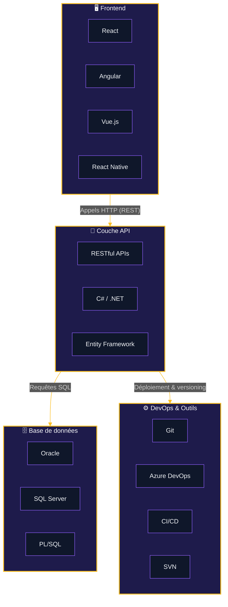

# Architecture technique

Diagramme des couches de l'architecture technique avec les technologies utilisées par Audace Rabarison.

```mermaid
%%{init: {'theme': 'dark', 'themeVariables': {
  'primaryColor': '#1e1b4b',
  'primaryTextColor': '#f8fafc',
  'primaryBorderColor': '#fbbf24',
  'lineColor': '#fbbf24',
  'secondaryColor': '#1a1a29',
  'tertiaryColor': '#0f172a',
  'fontFamily': 'Inter, sans-serif',
  'fontSize': '14px'
}}}%%
flowchart TB
    subgraph UI["🖥️ Frontend"]
        direction LR
        R1["React"]
        R2["Angular"]
        R3["Vue.js"]
        R4["React Native"]
    end

    subgraph API["🔌 Couche API"]
        A1["RESTful APIs"]
        A2["C# / .NET"]
        A3["Entity Framework"]
    end

    subgraph DB["🗄️ Base de données"]
        D1["Oracle"]
        D2["SQL Server"]
        D4["PL/SQL"]
    end

    subgraph DEVOPS["⚙️ DevOps & Outils"]
        O1["Git"]
        O2["Azure DevOps"]
        O3["CI/CD"]
        O4["SVN"]
    end

    UI -->|"Appels HTTP (REST)"| API
    API -->|"Requêtes SQL"| DB
    API -->|"Déploiement & versioning"| DEVOPS

    classDef layer fill:#1e1b4b,stroke:#fbbf24,stroke-width:2px,color:#f8fafc;
    classDef tech fill:#0f172a,stroke:#8b5cf6,stroke-width:1px,color:#f1f5f9;
    class UI,API,DB,DEVOPS layer;
    class R1,R2,R3,R4,A1,A2,A3,D1,D2,D3,D4,O1,O2,O3,O4 tech;
```