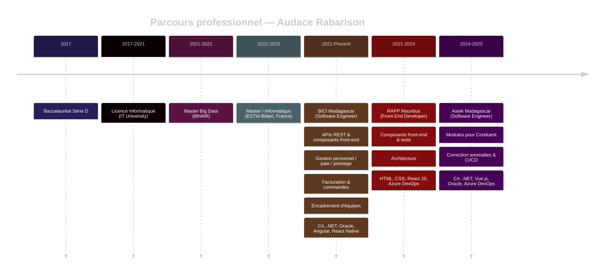

# Parcours professionnel

Timeline des expériences professionnelles d'Audace Rabarison (BICI → RAPP → Astek).

```mermaid
%%{init: {'theme': 'dark', 'themeVariables': {
  'primaryColor': '#1e1b4b',
  'primaryTextColor': '#f8fafc',
  'primaryBorderColor': '#fbbf24',
  'lineColor': '#8b5cf6',
  'secondaryColor': '#1a1a29',
  'tertiaryColor': '#0f172a',
  'fontFamily': 'Inter, sans-serif',
  'fontSize': '14px'
}}}%%
timeline
    title Parcours professionnel — Audace Rabarison
    2017 : Baccalauréat Série D
    2017-2021 : Licence Informatique (IT University)
    2021-2022 : Master Big Data (BIHAR)
    2022-2023 : Master I Informatique (ESTIA Bidart, France)
    2021-Present : BICI Madagascar (Software Engineer) : APIs REST & composants front-end : Gestion personnel / paie / pointage : Facturation & commandes : Encadrement d'équipes : C#, .NET, Oracle, Angular, React Native
    2021-2024 : RAPP Mauritius (Front-End Developer) : Composants front-end & tests : Architecture : HTML, CSS, React JS, Azure DevOps
    2024-2025 : Astek Madagascar (Software Engineer) : Modules pour Conduent : Correction anomalies & CI/CD : C#, .NET, Vue.js, Oracle, Azure DevOps
```