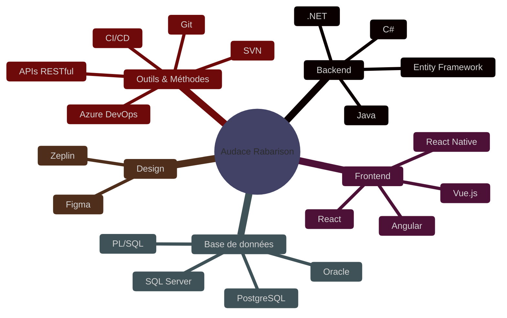

# Stack technologique

Relations entre les compétences techniques d'Audace Rabarison.

```mermaid
%%{init: {'theme': 'dark', 'themeVariables': {
  'primaryColor': '#1e1b4b',
  'primaryTextColor': '#f8fafc',
  'primaryBorderColor': '#fbbf24',
  'lineColor': '#8b5cf6',
  'secondaryColor': '#1a1a29',
  'tertiaryColor': '#0f172a',
  'fontFamily': 'Inter, sans-serif',
  'fontSize': '14px'
}}}%%
mindmap
  root((Audace Rabarison))
    Backend
      C#
      .NET
      Entity Framework
      Java
    Frontend
      React
      Angular
      Vue.js
      React Native
    Base de données
      Oracle
      PL/SQL
      PostgreSQL
      SQL Server
    Design
      Figma
      Zeplin
    Outils & Méthodes
      APIs RESTful
      Git
      SVN
      Azure DevOps
      CI/CD
```